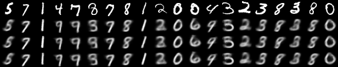

Variational Auto Encoder at latent dim = 2 for MNIST using Pytorch.\
The trained model has been saved '/model' \ 
The model seems to produce the same variation in every iteration. Free feel to suggest changes

